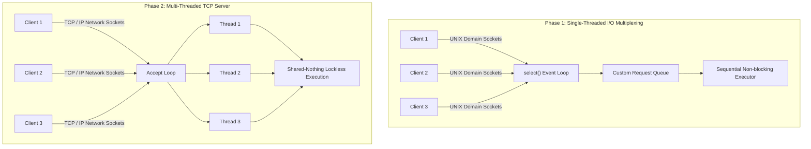

# 🚀 High-Performance Client-Server Systems Programming in C

[](https://en.wikipedia.org/wiki/C_(programming_language))
[](https://www.kernel.org/)
[](https://man7.org/linux/man-pages/man7/pthreads.7.html)
[-brightgreen)](https://valgrind.org/)
[](https://opensource.org/licenses/MIT)

> **Author**: Muhammaderfan Bagherinejad ([GitHub](https://github.com/merfan-bagheri) • [LinkedIn](https://www.linkedin.com/in/merfan-bagheri))

---

## 📖 Project Overview

This repository implements a low-level, high-performance C client-server architecture demonstrating advanced Linux systems programming, socket network communication, asynchronous event loops (I/O multiplexing via `select()`), multi-threaded concurrency (POSIX `pthreads`), custom binary application protocols, and strict zero-leak memory management verified with Valgrind.



---

## 📡 Protocol & Message Framing Specification

Communication operates over a strictly defined custom binary protocol to handle stream fragmentation and partial reads/writes over streaming sockets.

### Request Packet Format
| Field | Type | Size | Description |
| :--- | :--- | :--- | :--- |
| `REQ_LEN` | `uint16_t` | 2 Bytes | Total length of the request (Header + Argument) |
| `REQ_TYPE` | `uint16_t` | 2 Bytes | Command identifier (`1: LS`, `2: PWD`, `3: CAT`) |
| `REQ_ARG_LEN` | `uint16_t` | 2 Bytes | Byte length of the argument string |
| `REQ_ARG` | `char[]` | Variable | Argument payload (e.g. file or directory path) |

### Response Packet Format
| Field | Type | Size | Description |
| :--- | :--- | :--- | :--- |
| `RESPONSE_LEN` | `uint16_t` | 2 Bytes | Total length of the response message |
| `RESPONSE_DATA` | `char[]` | Variable | Command output string or binary file content |

---

## 🏗️ Architectural Comparison

### 🔹 Part 1: Single-Threaded & I/O Multiplexing (`phase_1/`)
- **Transport**: UNIX Domain Sockets (`AF_UNIX`).
- **Core Mechanism**: Non-blocking sockets (`O_NONBLOCK` via `fcntl()`) monitored concurrently by the `select()` system call.
- **Queueing & Stream Safety**: Custom linked-list request queue ensuring no dropped packets. Robust `memmove()` buffer shifting for partial stream reassembly.
- **Zero CPU Waste**: Dynamic timeout management (blocks when queue is empty, non-blocking polling when pending requests exist).

### 🔸 Part 2: Multi-Threaded TCP Server (`phase_2/`)
- **Transport**: Internet TCP Sockets (`AF_INET`).
- **Concurrency Model**: POSIX Threads (`pthreads`), thread-per-client model with detached worker threads (`pthread_detach`).
- **Lock-Free Concurrency**: Shared-nothing architecture with per-thread dynamically allocated descriptors—100% thread-safe with zero mutex contention.
- **Stream Wrappers**: `read_all` and `write_all` loop wrappers guaranteeing exact payload delivery over TCP.

---

## 📂 Repository Structure

```
socket_programming/
├── phase_1/                    # Phase 1: UNIX Domain + select() I/O Multiplexing
│   ├── client.c
│   ├── server.c
│   ├── common.h
│   └── stress_test.py
├── phase_2/                    # Phase 2: TCP Multi-Threaded Server (pthreads)
│   ├── client.c
│   ├── server.c
│   ├── common.h
│   └── stress_test.py
├── references/                 # Core network specifications and recruitment guides
│   ├── C Recruitment Task.pdf
│   ├── cs556-3rd-tutorial.pdf
│   └── sockbookv2_1.pdf
└── README.md
```

---

## 💻 Compilation & Execution

### Phase 1: UNIX Domain Server
```bash
cd phase_1
gcc -Wall -Wextra -O2 server.c -o server
gcc -Wall -Wextra -O2 client.c -o client

# Start server
./server

# In another terminal:
./client pwd
./client ls /var
./client cat /etc/passwd
```

### Phase 2: Multi-Threaded TCP Server
```bash
cd phase_2
gcc -Wall -Wextra -O2 server.c -o server -pthread
gcc -Wall -Wextra -O2 client.c -o client

# Start server
./server

# In another terminal:
./client pwd
./client ls /root
./client cat /etc/hostname
```

---

## 🧪 Rigorous Memory Leak Testing (Valgrind)

Both client and server implementations were validated with **Valgrind** under extreme concurrent load to guarantee zero memory leaks and safe signal shutdown.

```bash
# Server Memory Validation
valgrind --leak-check=full --show-leak-kinds=all --track-origins=yes ./server

# Client Memory Validation
valgrind --leak-check=full ./client ls /
```

> **Valgrind Result**: `0 bytes in 0 blocks lost`. All dynamically allocated memory in `ClientState` buffers and request queues is cleanly freed on graceful `SIGINT` termination.

---

## 📊 Stress Testing & Theoretical Limits

The included `stress_test.py` benchmarks server capacity using Python's `concurrent.futures.ThreadPoolExecutor`:

```bash
# Stress Test Phase 1 (UNIX Domain)
python3 stress_test.py --mode unix --clients 200 --requests 10000

# Stress Test Phase 2 (Multi-Threaded TCP)
python3 stress_test.py --mode tcp --clients 200 --requests 10000
```

- **I/O Multiplexing (Phase 1)**: Extremely high throughput for non-blocking operations; susceptible to head-of-line blocking on heavy disk I/O.
- **Multi-Threading (Phase 2)**: Complete isolation of blocking tasks; scales gracefully until hitting OS file descriptor limits (`ulimit -n`).

---

## 📜 License
This project is open-source under the [MIT License](LICENSE).
