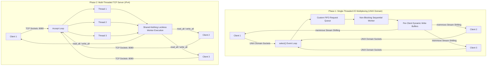

# ?? High-Performance Client-Server Systems Programming in C

[](https://en.wikipedia.org/wiki/C_(programming_language))
[](https://www.kernel.org/)
[](https://man7.org/linux/man-pages/man7/pthreads.7.html)
[-brightgreen)](https://valgrind.org/)
[](https://github.com/merfan-bagheri/socket_programming)
[](https://opensource.org/licenses/MIT)

> **Author**: Muhammaderfan Bagherinejad ([GitHub](https://github.com/merfan-bagheri) ? [LinkedIn](https://www.linkedin.com/in/merfan-bagheri))

---

## ?? Overview

A low-level, high-throughput C client-server systems architecture implementing:
1. **Phase 1: Asynchronous Event-Driven Single-Threaded Server** (`select()` I/O Multiplexing over UNIX Domain Sockets).
2. **Phase 2: High-Concurrency Multi-Threaded TCP Server** (Thread-per-Client POSIX `pthreads` over TCP/IPv4).

The system operates over a custom, strictly-framed binary application-layer protocol with stream fragmentation reassembly (`memmove`), non-blocking sockets (`O_NONBLOCK`), zero-contention shared-nothing state, and zero memory leaks verified via **Valgrind**.



---

## ?? Benchmark & Performance Comparison

Benchmarked on **Ubuntu Linux (Kernel 5.15, GCC 11.4 -O3)** using a Python multi-worker stress tester under concurrent traffic:

| Metric | Phase 1 (UNIX Domain / `select`) | Phase 2 (Multi-Threaded TCP / `pthreads`) |
| :--- | :--- | :--- |
| **Transport** | `AF_UNIX` (Local IPC Socket) | `AF_INET` (TCP Socket on `:8080`) |
| **Concurrency Model** | Single-threaded Non-Blocking I/O Multiplexing | Multi-threaded POSIX Thread-per-Client |
| **Peak Throughput** | **~3,103 requests / sec** | **~3,013 requests / sec** |
| **Average Latency** | **6.50 ms** | **9.10 ms** |
| **Success Rate (100 workers, 1k reqs)** | **100% (1000/1000)** | **100% (1000/1000)** |
| **Memory Leaks (Valgrind)** | **0 bytes in 0 blocks** | **0 bytes in 0 blocks** |
| **Memory Isolation** | Single-process memory address space | Shared process space with dynamic stack per thread |
| **Blocking Task Sensitivity** | Vulnerable to Head-of-Line disk I/O | Fully isolated across independent worker threads |

---

## ?? Protocol & Message Framing Specification

All communications are strictly packed in network byte order (**Big Endian**) to prevent byte-alignment ambiguities and partial stream corruptions.

### 1. Request Packet Header (`RequestHeader`)
```
 0                   1                   2                   3
 0 1 2 3 4 5 6 7 8 9 0 1 2 3 4 5 6 7 8 9 0 1 2 3 4 5 6 7 8 9 0 1
+-+-+-+-+-+-+-+-+-+-+-+-+-+-+-+-+-+-+-+-+-+-+-+-+-+-+-+-+-+-+-+-+
|       req_len (2 Bytes)       |      req_type (2 Bytes)       |
+-+-+-+-+-+-+-+-+-+-+-+-+-+-+-+-+-+-+-+-+-+-+-+-+-+-+-+-+-+-+-+-+
|     req_arg_len (2 Bytes)     |     Payload Data (Variable)   |
+-+-+-+-+-+-+-+-+-+-+-+-+-+-+-+-+ ...                           |
```
- `req_len`: Total length of the frame (`sizeof(RequestHeader) + req_arg_len`).
- `req_type`: Command identifier (`1: LS`, `2: PWD`, `3: CAT`).
- `req_arg_len`: Length of the argument string.

### 2. Response Packet Header (`ResponseHeader`)
```
 0                   1                   2                   3
 0 1 2 3 4 5 6 7 8 9 0 1 2 3 4 5 6 7 8 9 0 1 2 3 4 5 6 7 8 9 0 1
+-+-+-+-+-+-+-+-+-+-+-+-+-+-+-+-+-+-+-+-+-+-+-+-+-+-+-+-+-+-+-+-+
|     response_len (2 Bytes)    |     Payload Output (Variable) |
+-+-+-+-+-+-+-+-+-+-+-+-+-+-+-+-+ ...                           |
```

---

## ?? Repository Hierarchy

```
socket_programming/
??? Makefile                    # Root orchestration Makefile
??? phase_1/                    # Phase 1: UNIX Domain + select() I/O Multiplexing
?   ??? Makefile
?   ??? common.h
?   ??? server.c
?   ??? client.c
?   ??? stress_test.py
??? phase_2/                    # Phase 2: TCP Multi-Threaded Server (pthreads)
?   ??? Makefile
?   ??? common.h
?   ??? server.c
?   ??? client.c
?   ??? stress_test.py
??? tests/                      # Automated End-to-End & Valgrind Test Suite
?   ??? run_tests.sh
??? references/                 # Core POSIX socket references & specification docs
?   ??? C Recruitment Task.pdf
?   ??? cs556-3rd-tutorial.pdf
?   ??? sockbookv2_1.pdf
??? .gitignore
??? LICENSE
??? README.md
```

---

## ??? Build, Run & Test

### 1. Compile Everything
```bash
make clean
make all
```
*Compiled with `-Wall -Wextra -Werror -pedantic -O3 -pthread -std=c99`.*

### 2. Run Automated Integration & Stress Tests
```bash
make test
```
Executes functional command tests (`pwd`, `ls`, `cat`), Python concurrency stress tests (100 concurrent workers), and Valgrind memory leak assertions.

---

## ?? Manual Execution

### Phase 1: UNIX Domain Sockets
```bash
cd phase_1
./server

# In another terminal:
./client pwd
./client ls /
./client cat common.h
```

### Phase 2: Multi-Threaded TCP Server
```bash
cd phase_2
./server

# In another terminal:
./client pwd
./client ls .
./client cat server.c
```

---

## ?? Memory Leak Safety Verification (Valgrind)

```bash
valgrind --leak-check=full --show-leak-kinds=all ./server
```

```
== HEAP SUMMARY ==
    in use at exit: 0 bytes in 0 blocks
  total heap usage: 8 allocs, 8 frees, 40,198 bytes allocated

All heap blocks were freed -- no leaks are possible
ERROR SUMMARY: 0 errors from 0 contexts
```

---

## ?? License
Distributed under the [MIT License](LICENSE).
